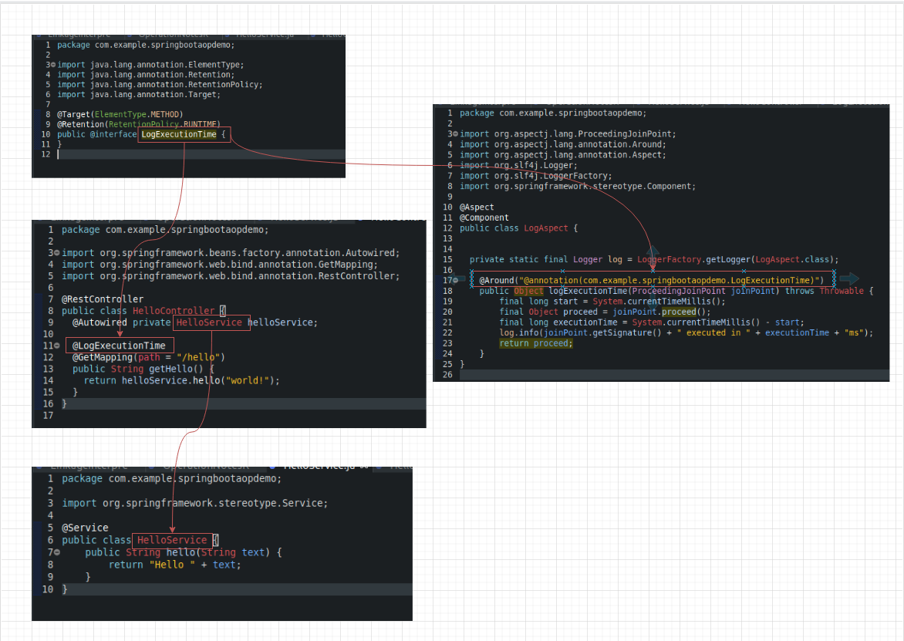

ลองทำตามจาก [ตัวอย่างการใช้ Spring boot AOP กับ annotation](https://medium.com/@wanichnuns/%E0%B8%95%E0%B8%B1%E0%B8%A7%E0%B8%AD%E0%B8%A2%E0%B9%88%E0%B8%B2%E0%B8%87%E0%B8%81%E0%B8%B2%E0%B8%A3%E0%B9%83%E0%B8%8A%E0%B9%89-spring-boot-aop-%E0%B8%81%E0%B8%B1%E0%B8%9A-annotation-%E0%B9%81%E0%B8%9A%E0%B8%9A%E0%B9%80%E0%B8%9A%E0%B8%9A%E0%B8%B5%E0%B9%8B-7ac25cd1235c)

